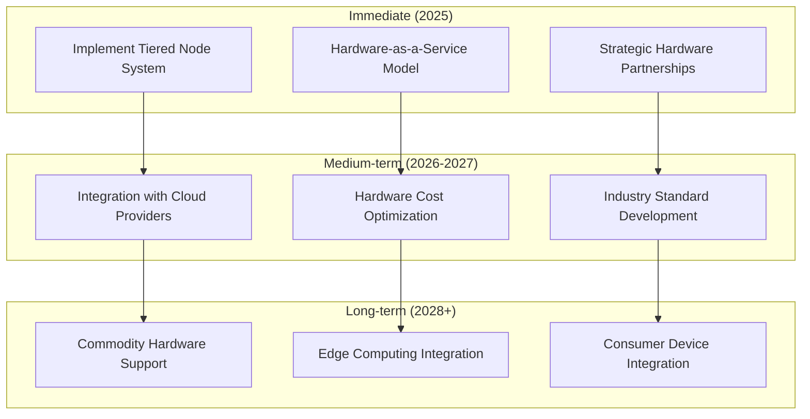
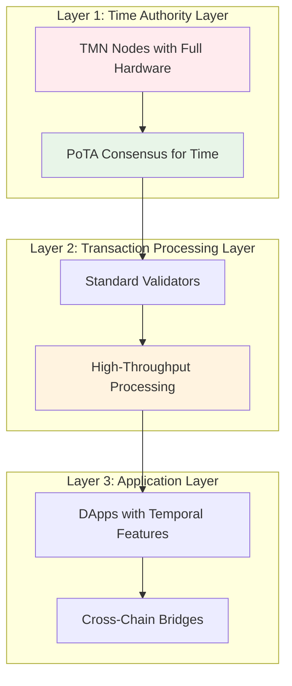
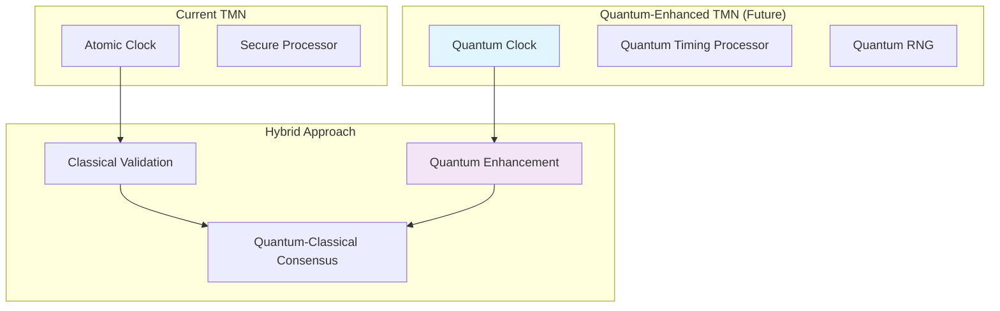
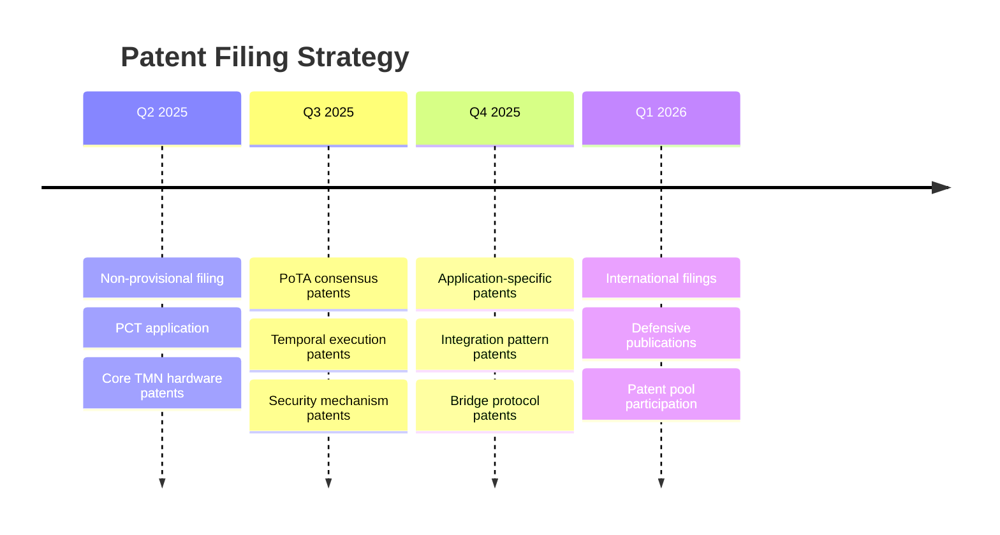
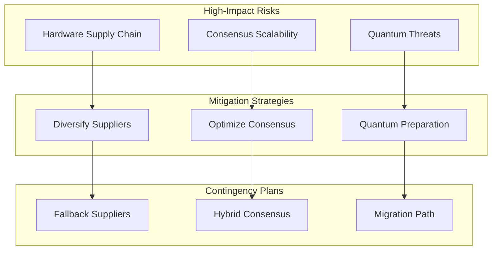

# ChronoLedger Design Review & Strategic Recommendations

*Critical Analysis and Forward-Looking Considerations for 2025*

## Executive Summary

ChronoLedger presents a technically ambitious and potentially groundbreaking approach to solving the "time oracle problem" in blockchain systems. However, several strategic, technical, and market considerations need immediate attention to maximize success probability and minimize risks. This review identifies key strengths, critical gaps, and actionable recommendations for the next 18 months.

## Core Strengths of Current Design

### 1. **Genuine Technical Innovation**
- Hardware-secured time as a blockchain primitive is genuinely novel
- PoTA consensus mechanism is a meaningful advance over existing approaches
- Multi-layered hardware security provides strong tamper resistance
- Post-quantum cryptography shows forward-thinking security design

### 2. **Clear Value Proposition for Niche Markets**
- Addresses real pain points in financial compliance (MiFID II, CAT)
- Critical infrastructure timing needs are growing (5G/6G, grid stability)
- Defense applications have clear budget justification for hardware costs

### 3. **Defensible Technology Moat**
- Hardware requirements create natural barriers to entry
- Patent protection provides legal moat
- Complex integration makes commoditization difficult

## Critical Design Gaps & Recommendations

### 1. **Hardware Economics Crisis** ⚠️ **URGENT**

**Problem**: TMN hardware costs ($10K-$50K per node) may be prohibitive for network bootstrapping and decentralization.

**New Considerations**:
- Current atomic clock costs are dropping 10-15% annually
- SiTime and other vendors are targeting sub-$1K CSACs by 2027
- Cloud providers are investing heavily in precision timing infrastructure

**Recommendations**:


**Specific Actions**:
1. **Tiered Node Architecture**: 
   - Tier 1: Full TMN nodes with complete hardware (founding/enterprise nodes)
   - Tier 2: Partial TMN nodes with TCXO + HSM (mid-tier participants)
   - Tier 3: Validator nodes that verify but don't generate time (broader participation)

2. **Hardware-as-a-Service Model**:
   - ChronoLedger operates TMN infrastructure
   - Customers lease "temporal compute" without hardware ownership
   - Creates recurring revenue while reducing barriers to entry

3. **Strategic Partnerships**:
   - Partner with atomic clock manufacturers for volume discounts
   - Collaborate with cloud providers (AWS, Google, Azure) for hosted TMNs
   - Work with telecom companies who need precision timing anyway

### 2. **Market Positioning & Go-to-Market Strategy** ⚠️ **URGENT**

**Problem**: Current positioning may be too broad and technically focused for early adoption.

**New Market Insights**:
- ESG reporting requirements are driving demand for supply chain transparency
- Central Bank Digital Currencies (CBDCs) need infrastructure-grade timing
- AI training requires precise timing for distributed computing
- Carbon markets need verifiable timestamps for emissions data

**Recommended Market Strategy**:

#### Phase 1: Infrastructure-as-a-Service (2025-2026)
**Target**: Don't build a blockchain, build the timing infrastructure

```solidity
// Example: Timing Infrastructure API
interface IChronoLedgerService {
    // High-precision timestamp service
    function getVerifiedTimestamp() external view returns (uint256 timestamp, bytes memory proof);
    
    // Scheduled execution service
    function scheduleExecution(address target, bytes calldata data, uint256 executeTime) external;
    
    // Time-locked escrow service
    function createTimeLockedEscrow(address beneficiary, uint256 unlockTime) external payable;
    
    // Temporal proof verification
    function verifyTemporalProof(uint256 timestamp, bytes memory proof) external view returns (bool);
}
```

**Revenue Model**: 
- $0.001-$0.01 per timestamp verification
- $1-$10 per scheduled execution
- $100-$1000 per month for API access tiers

#### Phase 2: Industry-Specific Solutions (2026-2027)
**Targets**: 
- **Financial Services**: "ChronoLedger Compliance Suite"
- **Supply Chain**: "ChronoLedger Provenance Platform"  
- **Government**: "ChronoLedger Security Infrastructure"

#### Phase 3: Full Blockchain Platform (2027+)
Launch the complete Temporal Blockchain after proving infrastructure value.

### 3. **Technical Architecture Improvements**

#### A. **Hybrid Consensus Model**
Instead of pure PoTA, implement a hybrid model:



**Benefits**:
- Separates expensive time consensus from cheap transaction processing
- Allows higher throughput for non-temporal operations
- Reduces hardware requirements for transaction validators

#### B. **Temporal State Channels**
Enable off-chain temporal operations with on-chain settlement:

```solidity
contract TemporalStateChannel {
    struct ChannelState {
        uint256 nonce;
        uint256 lastTimestamp;
        mapping(address => uint256) balances;
        bytes32 stateHash;
    }
    
    function openChannel(address counterparty, uint256 deposit) external;
    function updateState(bytes memory signedState) external;
    function closeChannel(bytes memory finalState) external;
    
    // Temporal-specific features
    function scheduleChannelAction(uint256 executeTime, bytes memory action) external;
    function disputeTimestamp(uint256 disputedTime, bytes memory proof) external;
}
```

#### C. **Quantum-Enhanced Timing**
Prepare for quantum timing advantages:



### 4. **Regulatory & Compliance Strategy** ⚠️ **HIGH PRIORITY**

**New Regulatory Landscape**:
- EU AI Act requires timing for AI system audits
- US Infrastructure Bill allocates $65B for timing infrastructure
- China's "New Infrastructure" plan includes precision timing
- ISO 8601 extensions for blockchain timestamps in development

**Recommendations**:

#### A. **Regulatory Compliance Framework**
```typescript
interface ComplianceFramework {
  // Jurisdiction-specific compliance
  validateMiFIDII(transaction: Transaction): ComplianceReport;
  validateCAT(orderEvent: OrderEvent): CATReport;
  validateSFTR(securitiesTransaction: Transaction): SFTRReport;
  
  // International standards
  validateISO8601Extended(timestamp: Timestamp): boolean;
  generateNISTTimestamp(event: Event): NISTTimestamp;
  
  // Audit capabilities
  generateAuditTrail(fromTime: Timestamp, toTime: Timestamp): AuditReport;
  exportComplianceData(format: ExportFormat): ComplianceData;
}
```

#### B. **Standards Body Engagement**
- **NIST**: Collaborate on timing standards for distributed systems
- **ISO**: Participate in blockchain timing standard development
- **IETF**: Contribute to Network Time Security working group
- **IEEE**: Engage with 1588 (PTP) standardization efforts

### 5. **Competitive Response Strategy**

**Emerging Threats**:
- AWS launching "Amazon Time Sync Service" with microsecond precision
- Google's "True Time" API gaining adoption beyond Spanner
- Traditional timestamping authorities improving hardware security
- Other blockchain projects adding timing features

**Strategic Response**:

#### A. **Patent Portfolio Acceleration**


#### B. **Open Source Strategy**
Consider selective open sourcing to build ecosystem:
- Open source developer tools and SDKs
- Open source reference client implementation
- Keep core TMN firmware and consensus algorithm proprietary
- Create "ChronoLedger Compatible" certification program

### 6. **Implementation Roadmap Refinement**

**Revised Priorities for 2025**:

#### Q1 2025: Foundation & Validation
- [ ] Complete patent filing strategy
- [ ] Build working TMN prototype (single unit)
- [ ] Validate atomic clock integration
- [ ] Initial customer discovery in target markets

#### Q2 2025: Proof of Concept
- [ ] Deploy 3-node TMN testnet
- [ ] Demonstrate PoTA consensus
- [ ] Build basic TEE with temporal opcodes
- [ ] Pilot with one financial services customer

#### Q3 2025: Market Validation
- [ ] Launch timing infrastructure API
- [ ] Deploy 10-node pilot network
- [ ] Onboard 3-5 pilot customers
- [ ] Demonstrate ROI for target use cases

#### Q4 2025: Platform Development
- [ ] Scale to 50-node network
- [ ] Launch developer tools and SDKs
- [ ] Begin enterprise partnerships
- [ ] Prepare for Series A funding

### 7. **Risk Mitigation Strategies**

#### Technical Risks


#### Market Risks
- **Competition**: Focus on first-mover advantage and patent protection
- **Adoption**: Start with infrastructure-as-a-service model
- **Regulation**: Proactive engagement with regulatory bodies
- **Technology Shift**: Maintain crypto-agility and modular design

### 8. **Team & Funding Strategy**

**Critical Hires (Priority Order)**:
1. **Hardware Security Engineer** - TMN development leader
2. **Cryptography Expert** - Post-quantum implementation
3. **Distributed Systems Engineer** - Consensus optimization  
4. **Business Development Lead** - Customer acquisition
5. **Regulatory Affairs Specialist** - Compliance navigation

**Funding Requirements**:
- **Seed ($3-5M)**: Prototype development, team building, IP protection
- **Series A ($15-25M)**: Pilot network deployment, customer acquisition
- **Series B ($50-100M)**: Full platform development, international expansion

## Strategic Recommendations Summary

### Immediate Actions (Next 90 Days)
1. **Pivot to Infrastructure-First Strategy**: Launch timing infrastructure before full blockchain
2. **Accelerate Patent Filing**: File continuation patents aggressively
3. **Build Tiered Node Architecture**: Reduce hardware barriers to entry
4. **Engage Standards Bodies**: Participate in timing standardization efforts
5. **Customer Discovery**: Deep dive into specific use case requirements

### Medium-Term Strategy (6-18 Months)
1. **Deploy Pilot Network**: 10-50 node testnet with real customers
2. **Build Developer Ecosystem**: SDKs, tools, documentation
3. **Regulatory Positioning**: Establish compliance frameworks
4. **Strategic Partnerships**: Hardware vendors, cloud providers, system integrators

### Long-Term Vision (2-5 Years)
1. **Become the Internet's Timing Layer**: Infrastructure play, not just blockchain
2. **Enable New Application Categories**: AI training, IoT coordination, scientific computing
3. **Global Standards Influence**: Shape international timing standards
4. **Platform Economics**: Transform from service provider to platform ecosystem

## Conclusion

ChronoLedger has the potential to become foundational infrastructure for the next generation of time-critical applications. However, success requires strategic focus on infrastructure-first deployment, aggressive IP protection, and careful market positioning. The technical vision is sound, but execution strategy must prioritize near-term value delivery over long-term technical purity.

The recommended approach de-risks the venture while preserving the option to build the full Temporal Blockchain once market demand and technical feasibility are proven. This positions ChronoLedger to capture immediate value in the growing precision timing market while building toward the larger vision of trustless temporal computing.


