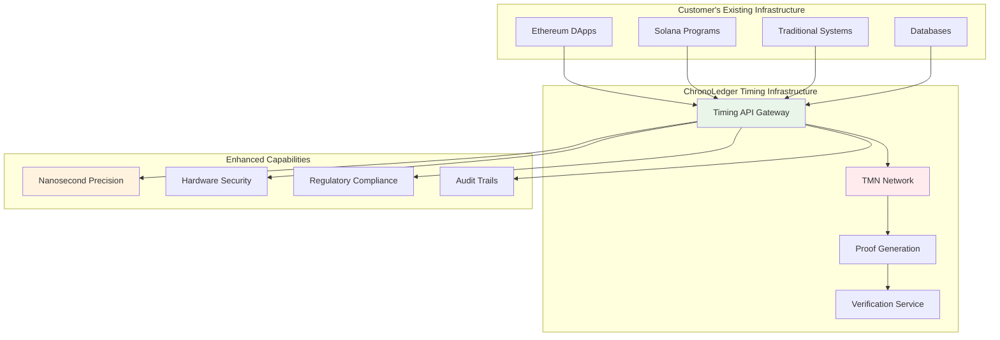
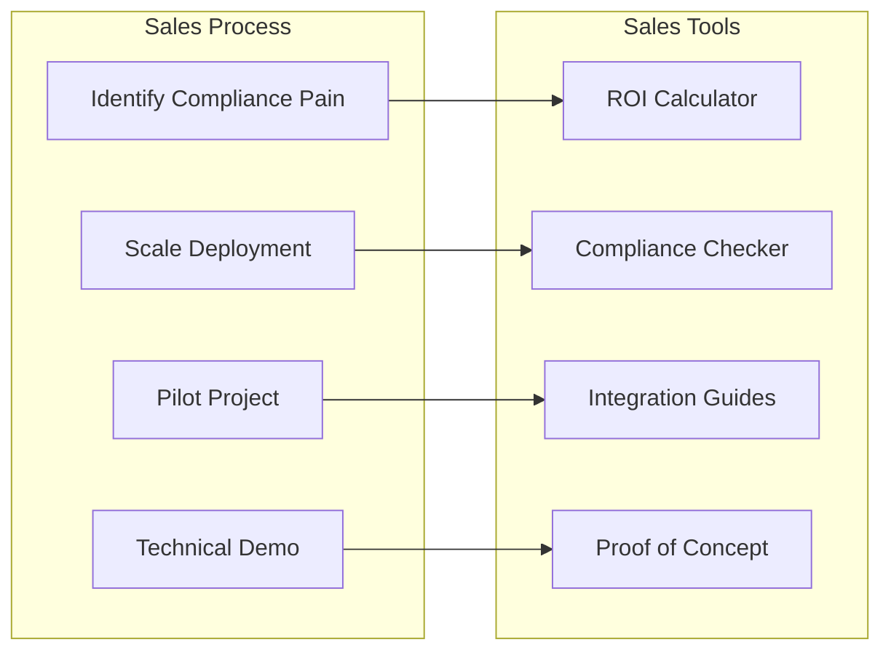
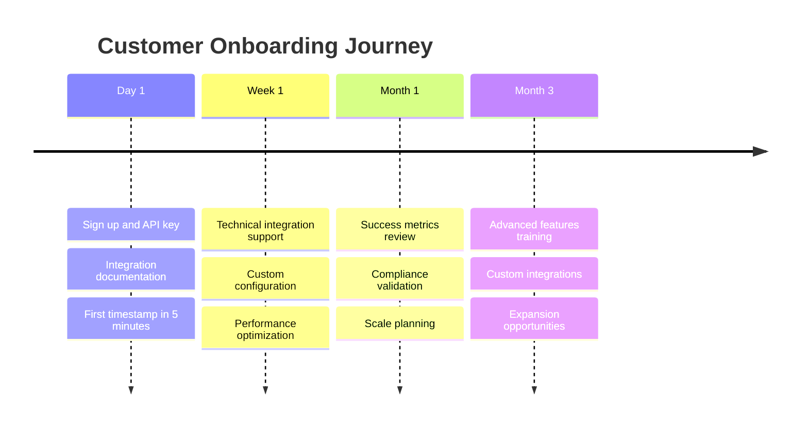
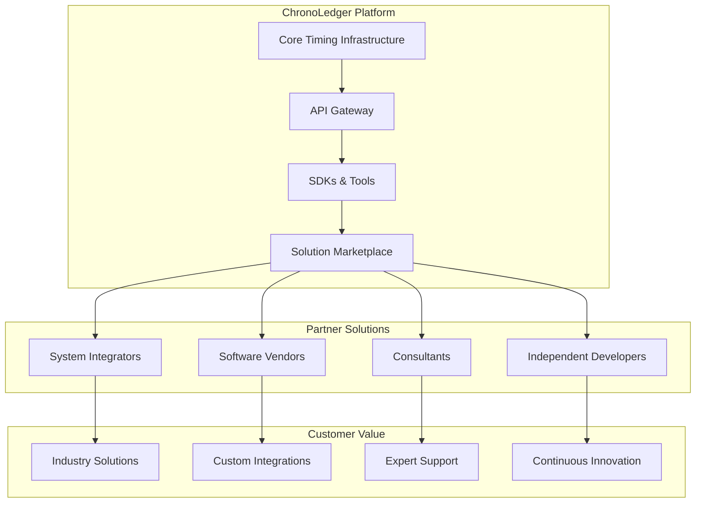
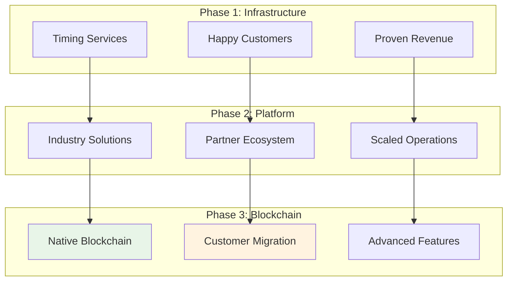

# ChronoLedger Go-to-Market Strategy: Infrastructure-First Approach

*From Hardware-Secured Blockchain to Universal Timing Infrastructure*

## Strategic Pivot: Why Infrastructure-First Wins

### The Current Problem with "Blockchain-First" Strategy

**The Original Approach**: Build a complete Temporal Blockchain, convince users to migrate to it.

**Why This Fails**:
- Requires customers to abandon existing blockchain infrastructure
- High switching costs and integration complexity  
- Network effects mean empty blockchain has no value
- $50K+ TMN hardware requirements kill decentralization
- Takes 3-5 years to reach minimum viable network size

**The New Approach**: Build timing infrastructure that enhances existing systems.

**Why This Wins**:
- Immediate value without migration
- Works with existing Ethereum, Solana, Bitcoin, traditional systems
- Revenue from day one
- Proves market demand before massive hardware investment
- Creates moat through integration, not just technology

## Phase 1: Timing Infrastructure as a Service (2025-2026)

### 1.1 Core Value Proposition

**"Atomic clock precision for any system, without the hardware."**

Instead of asking customers to join a new blockchain, we provide timing services that enhance their existing infrastructure:



### 1.2 Service Architecture

#### Core Services Offered

**A. Precision Timestamping Service**
```typescript
interface TimestampingService {
  // Basic timestamping
  getTimestamp(): Promise<{
    timestamp: bigint;           // Nanosecond precision
    confidence: number;          // Accuracy confidence interval
    proof: HardwareProof;       // Hardware attestation
    nistCompliant: boolean;     // NIST traceability
  }>;
  
  // Batch timestamping for high volume
  getTimestampBatch(count: number): Promise<TimestampBatch>;
  
  // Scheduled timestamping
  scheduleTimestamp(futureTime: bigint): Promise<ScheduledTimestamp>;
}
```

**B. Temporal Proof Service**
```typescript
interface TemporalProofService {
  // Generate proofs of when something happened
  generateProof(event: Event, timestamp: bigint): Promise<TemporalProof>;
  
  // Verify proofs (can be done by anyone)
  verifyProof(proof: TemporalProof): Promise<VerificationResult>;
  
  // Batch verification for efficiency
  verifyProofBatch(proofs: TemporalProof[]): Promise<VerificationResult[]>;
}
```

**C. Scheduled Execution Service**
```typescript
interface ScheduledExecutionService {
  // Schedule function calls for precise future execution
  scheduleExecution(
    target: string,           // Contract address or endpoint
    calldata: bytes,         // Function call data
    executeTime: bigint,     // Precise execution time
    gasLimit: number         // Execution parameters
  ): Promise<ScheduleId>;
  
  // Cancel scheduled executions
  cancelExecution(scheduleId: ScheduleId): Promise<boolean>;
  
  // Query execution status
  getExecutionStatus(scheduleId: ScheduleId): Promise<ExecutionStatus>;
}
```

**D. Compliance & Audit Service**
```typescript
interface ComplianceService {
  // Generate regulatory-compliant timestamps
  getMiFIDIITimestamp(transaction: Transaction): Promise<MiFIDIITimestamp>;
  getCATTimestamp(orderEvent: OrderEvent): Promise<CATTimestamp>;
  
  // Generate audit reports
  generateAuditReport(
    fromTime: bigint,
    toTime: bigint,
    includeProofs: boolean
  ): Promise<AuditReport>;
  
  // Export compliance data in various formats
  exportComplianceData(
    format: 'NIST' | 'ISO8601' | 'RFC3161' | 'Custom',
    criteria: ExportCriteria
  ): Promise<ComplianceExport>;
}
```

### 1.3 Revenue Model & Pricing

#### Pricing Tiers

**Developer Tier (Free)**
- 1,000 timestamps/month
- Basic precision (millisecond)
- Community support
- Standard proofs

**Professional Tier ($99/month)**
- 100,000 timestamps/month
- High precision (microsecond)
- Email support
- Enhanced proofs
- Basic compliance features

**Enterprise Tier ($999/month)**
- 10M timestamps/month
- Ultra precision (nanosecond)
- Dedicated support
- Hardware-grade proofs
- Full compliance suite
- Custom integrations

**Regulatory Tier ($9,999/month)**
- Unlimited timestamps
- Maximum precision
- 24/7 support
- Legally admissible proofs
- Full audit capabilities
- On-premise deployment options

#### Usage-Based Pricing
```typescript
interface PricingModel {
  timestampPricing: {
    basic: 0.001,      // $0.001 per timestamp
    precise: 0.01,     // $0.01 per nanosecond timestamp
    compliant: 0.1,    // $0.1 per regulatory timestamp
  };
  
  schedulingPricing: {
    simple: 1.0,       // $1 per scheduled execution
    complex: 10.0,     // $10 per complex scheduled execution
  };
  
  proofPricing: {
    generation: 0.1,   // $0.1 per proof generation
    verification: 0.01, // $0.01 per proof verification
  };
}
```

### 1.4 Target Customers & Use Cases

#### Primary Targets (Year 1)

**A. Financial Services - Compliance Departments**
- **Problem**: Need nanosecond-precision timestamps for MiFID II compliance
- **Solution**: Drop-in API that generates compliant timestamps
- **Value**: Avoid regulatory penalties (can be millions)
- **Sales Approach**: Direct to Chief Compliance Officers

```javascript
// Example integration for compliance
const chronoLedger = new ChronoLedgerClient({
  tier: 'regulatory',
  compliance: ['MiFID_II', 'CAT', 'SFTR']
});

async function recordTrade(trade) {
  const timestamp = await chronoLedger.getMiFIDIITimestamp(trade);
  
  // Store with regulatory-grade proof
  await tradeDB.insert({
    ...trade,
    timestamp: timestamp.value,
    proof: timestamp.proof,
    regulatoryCompliant: true
  });
}
```

**B. High-Frequency Trading Firms**
- **Problem**: Need tamper-proof audit trails for trading algorithms
- **Solution**: Hardware-attested timestamps for every order/execution
- **Value**: Protect against regulatory scrutiny and litigation
- **Sales Approach**: Direct to CTO/Head of Technology

**C. Enterprise Blockchain Teams**
- **Problem**: Need precise timing for DeFi protocols, NFT drops, governance
- **Solution**: Integrate with existing smart contracts
- **Value**: Enhanced security and fairness
- **Sales Approach**: Developer relations and ecosystem partnerships

```solidity
// Example smart contract integration
contract PrecisionAuction {
    using ChronoLedger for uint256;
    
    uint256 public auctionEndTime;
    
    function placeBid() external payable {
        // Get hardware-verified timestamp
        uint256 currentTime = ChronoLedger.getVerifiedTimestamp();
        require(currentTime < auctionEndTime, "Auction ended");
        
        // Bid logic with provable timing
    }
}
```

#### Secondary Targets (Year 2)

**D. Critical Infrastructure Operators**
- Power grid operators needing precise synchronization
- Telecom companies deploying 5G/6G networks
- Transportation systems requiring coordination

**E. Government & Defense**
- Agencies needing GPS-independent timing
- Systems requiring high-security timestamping
- Evidence management systems

**F. Scientific Research Institutions**
- Experiments requiring precise timing coordination
- Data integrity for long-term studies
- Multi-site research coordination

### 1.5 Sales & Marketing Strategy

#### Go-to-Market Channels

**1. Direct Enterprise Sales**


**2. Developer Ecosystem**
- GitHub presence with integration examples
- Developer documentation and tutorials
- Hackathon sponsorships
- Conference speaking engagements
- Open source developer tools

**3. Partner Channel**
- Systems integrators (Deloitte, Accenture, IBM)
- Blockchain infrastructure providers
- Compliance software vendors
- Cloud marketplaces (AWS, Azure, GCP)

#### Marketing Messaging Framework

**Primary Message**: "Atomic clock precision for your existing systems"

**Proof Points**:
- "10,000x more precise than NTP"
- "Hardware-secured, tamper-proof timestamps"
- "Regulatory compliant out of the box"
- "Integrates in minutes, not months"

**Competitive Positioning**:
- vs. NTP: "Hardware security vs. network vulnerability"
- vs. TSAs: "Real-time vs. batch processing"
- vs. Cloud timing: "Decentralized vs. single point of failure"
- vs. GPS: "Tamper-resistant vs. spoofable"

### 1.6 Customer Success & Retention

#### Onboarding Process


#### Success Metrics
- **Time to First Value**: < 5 minutes to first timestamp
- **Integration Success Rate**: > 95% successful integrations
- **Customer Satisfaction**: NPS > 70
- **Feature Adoption**: > 80% using multiple service types
- **Retention Rate**: > 95% annual retention

#### Expansion Strategies
1. **Vertical Expansion**: Add more services (compliance, auditing, analytics)
2. **Horizontal Expansion**: Expand to more systems within organization
3. **Geographic Expansion**: International compliance requirements
4. **Use Case Expansion**: New applications of precision timing

## Phase 2: Industry-Specific Solutions (2026-2027)

### 2.1 Vertical Market Solutions

Once the core infrastructure is proven, build industry-specific solutions:

#### A. ChronoLedger Compliance Suite (Financial Services)
```typescript
interface ComplianceSuite {
  // Automated compliance monitoring
  monitorTransactions(rules: ComplianceRules): Promise<ComplianceReport>;
  
  // Real-time compliance alerts
  setupComplianceAlerts(criteria: AlertCriteria): Promise<AlertSubscription>;
  
  // Automated reporting
  generateRegulatoryReport(
    period: ReportingPeriod,
    regulations: Regulation[]
  ): Promise<RegulatoryReport>;
  
  // Compliance analytics
  analyzeComplianceRisk(portfolio: Portfolio): Promise<RiskAnalysis>;
}
```

**Revenue Model**: $50K-500K annual licenses + usage fees

#### B. ChronoLedger Provenance Platform (Supply Chain)
```typescript
interface ProvenancePlatform {
  // Track items through supply chain
  trackItem(itemId: string, event: SupplyChainEvent): Promise<TrackingResult>;
  
  // Verify authenticity
  verifyAuthenticity(itemId: string): Promise<AuthenticityReport>;
  
  // Generate certificates
  generateCertificate(itemId: string, standard: CertificationStandard): Promise<Certificate>;
  
  // Audit trail
  getFullHistory(itemId: string): Promise<SupplyChainHistory>;
}
```

**Revenue Model**: $10K-100K annual licenses + per-item tracking fees

#### C. ChronoLedger Security Infrastructure (Government/Defense)
```typescript
interface SecurityInfrastructure {
  // Secure time distribution
  distributeSecureTime(endpoints: SecureEndpoint[]): Promise<DistributionResult>;
  
  // Evidence timestamping
  timestampEvidence(evidence: Evidence, chain: ChainOfCustody): Promise<EvidenceTimestamp>;
  
  // Secure communications timing
  synchronizeCommunications(network: SecureNetwork): Promise<SyncResult>;
  
  // Incident response timing
  coordinateResponse(incident: SecurityIncident): Promise<ResponseCoordination>;
}
```

**Revenue Model**: $100K-1M+ government contracts

### 2.2 Platform Strategy

#### Building the Ecosystem


## Phase 3: Full Blockchain Platform (2027+)

### 3.1 Evolution to Complete Platform

After proving infrastructure value and building ecosystem, launch the full Temporal Blockchain:

#### Migration Strategy


#### Value Proposition for Migration
- **Lower Costs**: No API fees for native blockchain usage
- **Enhanced Features**: Self-triggering contracts, advanced temporal logic
- **Greater Decentralization**: Full participation in consensus
- **New Revenue Models**: Staking, governance participation

## Implementation Roadmap

### Q1 2025: Foundation
- [ ] Complete TMN prototype development
- [ ] Build core timing infrastructure API
- [ ] Develop initial SDK (JavaScript/TypeScript)
- [ ] Establish legal entity and IP protection

### Q2 2025: Pilot Launch
- [ ] Deploy 3-node TMN pilot network
- [ ] Launch beta API with select customers
- [ ] Complete compliance integrations (MiFID II focus)
- [ ] Establish first enterprise partnerships

### Q3 2025: Market Validation
- [ ] Scale to 10-node network
- [ ] Onboard 10+ pilot customers
- [ ] Launch developer program
- [ ] Achieve $100K+ ARR

### Q4 2025: Commercial Launch
- [ ] Full commercial launch of infrastructure services
- [ ] Scale to 25-node network
- [ ] Achieve $1M+ ARR
- [ ] Series A fundraising

### 2026: Platform Development
- [ ] Launch industry-specific solutions
- [ ] International expansion
- [ ] Partner ecosystem development
- [ ] Achieve $10M+ ARR

### 2027+: Blockchain Evolution
- [ ] Launch full Temporal Blockchain
- [ ] Customer migration program
- [ ] Advanced temporal applications
- [ ] Global market leadership

## Success Metrics & KPIs

### Infrastructure Phase (2025-2026)
- **Technical KPIs**:
  - API uptime: > 99.95%
  - Timestamp precision: < 100 nanoseconds
  - API latency: < 100ms globally
  - Network size: 25+ TMN nodes

- **Business KPIs**:
  - Customers: 100+ paying customers
  - ARR: $5M+ annual recurring revenue
  - NPS: > 70 customer satisfaction
  - Churn: < 5% annual churn rate

### Platform Phase (2026-2027)
- **Market KPIs**:
  - Market share: Top 3 in precision timing
  - Geographic presence: 5+ countries
  - Industry verticals: 3+ verticals
  - Partner network: 50+ partners

- **Financial KPIs**:
  - ARR: $25M+ annual recurring revenue
  - Growth rate: > 100% YoY
  - Gross margin: > 80%
  - Path to profitability: Clear

### Blockchain Phase (2027+)
- **Ecosystem KPIs**:
  - Developer adoption: 1000+ developers
  - Applications: 100+ live applications
  - Transaction volume: Meaningful on-chain activity
  - Network effects: Self-sustaining ecosystem

## Risk Mitigation

### Market Risks
- **Competition**: Build strong moat through customer lock-in and network effects
- **Adoption**: Start with clear ROI and minimal switching costs
- **Technology**: Maintain technical leadership through R&D investment

### Execution Risks
- **Scaling**: Plan infrastructure scaling carefully
- **Quality**: Maintain service quality during rapid growth
- **Talent**: Recruit and retain key technical talent

### Financial Risks
- **Cash Flow**: Maintain 18+ months runway
- **Customer Concentration**: Diversify customer base
- **Pricing**: Validate pricing through market testing

This infrastructure-first approach transforms ChronoLedger from a risky blockchain startup into a proven infrastructure company with a clear path to the larger blockchain vision. It generates revenue immediately, validates market demand, and builds the foundation for long-term success.
