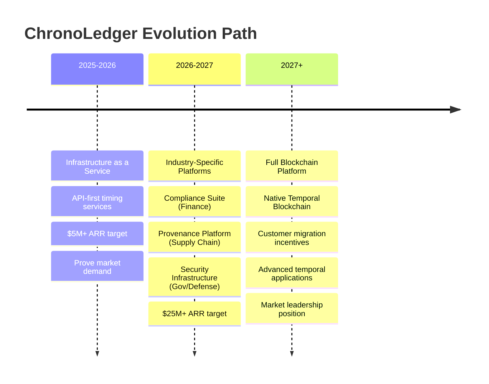

## Key Strategic Insights from the Go-to-Market Refinement

The infrastructure-first approach fundamentally changes ChronoLedger's risk profile and success probability:

### **From "Build It and They Will Come" to "Solve Real Problems Today"**

**Traditional Blockchain Approach Problems**:
- Requires customers to abandon existing infrastructure
- Network effects mean empty blockchain = no value
- 3-5 year timeline to minimum viable network
- High switching costs kill adoption

**Infrastructure-First Advantages**:
- **Immediate Value**: Works with existing Ethereum, Solana, traditional systems
- **No Migration Required**: Drop-in API integration in minutes
- **Revenue from Day One**: Paying customers validate demand
- **Lower Risk**: Proves market before massive hardware investment

### **Three-Phase Evolution Strategy**

### **Revenue Model That Actually Works**

Instead of hoping for token appreciation, build real B2B revenue:

- **Year 1**: $100K-1M ARR from precision timestamping APIs
- **Year 2**: $1M-5M ARR from compliance and enterprise solutions  
- **Year 3**: $5M-25M ARR from industry platforms
- **Year 4+**: $25M+ ARR from full blockchain ecosystem

### **Customer Acquisition That Makes Sense**

**Phase 1 Targets** (concrete, immediate pain):
- **Chief Compliance Officers** at banks (MiFID II compliance costs millions if wrong)
- **HFT Firms** (regulatory scrutiny requires tamper-proof audit trails)
- **Enterprise Blockchain Teams** (need precise timing for DeFi/NFT fairness)

**Sales Process**:
1. **Identify Compliance Pain**: "How much do MiFID II violations cost you?"
2. **Technical Demo**: "Get nanosecond timestamps in 5 minutes"
3. **Pilot Project**: "Prove value with your real use case"
4. **Scale Deployment**: "Roll out across your organization"

### **Competitive Moat Through Integration, Not Just Technology**

**Traditional Moat**: "Our atomic clocks are better"
**Real Moat**: "We're integrated into your critical compliance workflows"

Once customers depend on ChronoLedger for regulatory compliance, switching costs become enormous. This creates sustainable competitive advantage.

### **De-Risked Path to Blockchain Vision**

The beauty of this approach is it preserves the option to build the full Temporal Blockchain while proving viability first:

- **If infrastructure succeeds**: Migrate customers to native blockchain for enhanced features
- **If infrastructure struggles**: Pivot to pure SaaS without blockchain complexity
- **If markets shift**: Adapt quickly since core timing infrastructure has many applications

### **Why This Strategy Wins**

1. **Immediate Revenue**: Paying customers from month 1
2. **Market Validation**: Real customers prove demand before major investment
3. **Risk Reduction**: Smaller capital requirements, faster feedback loops
4. **Network Effects**: Happy infrastructure customers become blockchain early adopters
5. **Strategic Optionality**: Multiple paths to success, not just blockchain-or-bust

This refined go-to-market strategy transforms ChronoLedger from a high-risk blockchain moonshot into a pragmatic infrastructure company with a clear path to market leadership. It's the difference between "building the future" and "solving today's problems while building the future."

The infrastructure-first approach is how companies like Stripe (payments infrastructure) and Twilio (communications infrastructure) built billion-dollar businesses - by solving immediate, concrete problems first, then expanding the platform.
