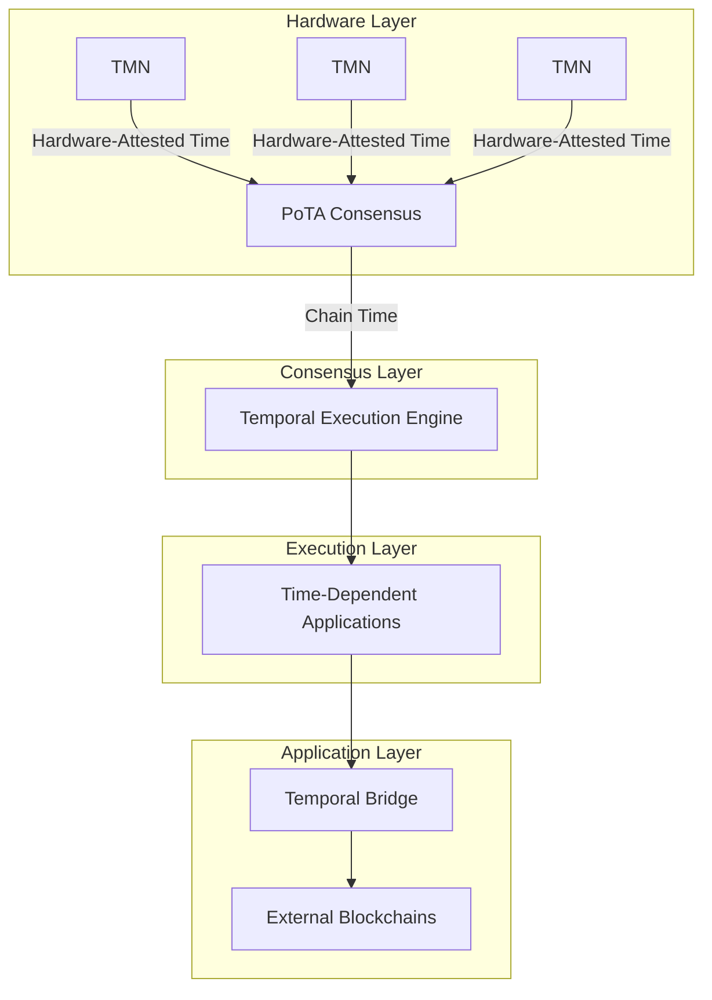

# ChronoLedger: Hardware-Secured Time for the Blockchain Era

**The World's First Blockchain with Hardware-Secured Consensus Time for High-Assurance Applications**

[](docs/patent-info.md)
[]()
[]()

## Overview

ChronoLedger Systems is pioneering the **Temporal Blockchain**, a revolutionary Layer 1 protocol that integrates tamper-proof, high-precision timekeeping directly into the core of distributed ledger technology. Unlike existing blockchains that rely on insecure node clocks or centralized oracles, ChronoLedger makes time a verifiable, first-class element of the blockchain itself.

### The Problem: Time is Blockchain's Achilles' Heel

Current blockchain systems suffer from fundamental temporal limitations:
- **Node Timestamps**: Inaccurate, subjective, easily manipulated
- **External Oracles**: Centralized points of failure, trust dependencies
- **Relative Ordering**: Cannot provide verifiable absolute time

This "time oracle problem" severely limits blockchain applications in finance, compliance, IoT, and critical infrastructure where precise, trustworthy time is non-negotiable.

### Our Solution: Hardware-Secured "Chain Time"

ChronoLedger solves this through three core innovations:

1. **Temporal Mining Nodes (TMNs)**: Specialized hardware featuring:
   - Chip-Scale Atomic Clocks (CSACs) for nanosecond precision
   - Secure Time Processing Units (STPUs) with HSMs and PUFs
   - Tamper-resistant enclosures with environmental monitoring

2. **Proof of Temporal Authority (PoTA)**: Novel consensus mechanism where:
   - Voting power derives from proven temporal accuracy
   - Hardware-attested timestamps are cryptographically verified
   - Temporal reputation incentivizes accurate timekeeping

3. **Temporal Execution Engine (TEE)**: Enhanced smart contract VM with:
   - Native temporal opcodes (`TIMESTAMP_NOW`, `SCHEDULE_CALL`)
   - Self-triggering contracts based on verified time
   - Autonomous temporal workflows without oracles

## Key Features

- **🕐 Nanosecond Precision**: Hardware atomic clocks provide unprecedented accuracy
- **🛡️ Tamper-Proof**: Multi-layered hardware security prevents time manipulation
- **🤖 Self-Triggering**: Smart contracts execute autonomously based on verified time
- **🌐 Interoperable**: Temporal Bridge allows other chains to leverage our time
- **🔌 Offline Capable**: Maintains verifiable time during network disruptions
- **📋 Compliance Ready**: Meets regulatory requirements for timestamp integrity

## Target Applications

ChronoLedger is designed for high-assurance use cases where time precision and security are critical:

### Financial Services
- **Regulatory Compliance**: MiFID II, CAT reporting with hardware-attested timestamps
- **Secure Settlement**: Precise automated settlement for derivatives and complex instruments
- **HFT Auditability**: Tamper-proof trading timestamps for compliance and surveillance

### Critical Infrastructure & Defense
- **Resilient PNT**: GPS-independent timing for critical systems
- **Secure Communications**: Network synchronization resistant to timing attacks
- **Evidence Chain**: Verifiable custody and forensic timestamps

### Legal & Compliance
- **Digital Evidence**: Irrefutable timestamps for legal proceedings
- **Long-term Archival**: Tamper-proof records with post-quantum security
- **IP Protection**: Verifiable creation and modification timestamps

## Architecture



## Getting Started

### For Developers

**Note**: ChronoLedger is currently in active development. The following will be available soon:

```bash
# Install ChronoLedger SDK (Coming Soon)
npm install @chronoledger/sdk

# Connect to testnet (Coming Soon)
chronoledger connect --network testnet
```

Example smart contract with temporal features:

```solidity
// SPDX-License-Identifier: MIT
pragma solidity ^0.8.0;

contract TemporalEscrow {
    address payable public seller;
    uint256 public releaseTime;

    constructor(address payable _seller, uint256 _lockDuration) payable {
        seller = _seller;
        releaseTime = TIMESTAMP_NOW + _lockDuration; // Hardware-verified time
        
        // Schedule automatic release
        SCHEDULE_CALL(
            gas, 
            address(this), 
            0, 
            abi.encodeWithSignature("release()"), 
            releaseTime
        );
    }

    function release() public {
        require(msg.sender == address(this), "Only self-callable");
        require(TIMESTAMP_NOW >= releaseTime, "Too early");
        seller.transfer(address(this).balance);
    }

    receive() external payable {}
}
```

### For Node Operators

**Hardware Requirements** (TMN Specifications):
- Chip-Scale Atomic Clock (CSAC) - Cesium/Rubidium, ≤1×10⁻¹²/day stability
- Secure Time Processing Unit (STPU) - Custom ASIC/Secure MCU
- Hardware Security Module - FIPS 140-3 Level 4 certified
- Physical Unclonable Function (PUF) for hardware identity
- Tamper-resistant enclosure with environmental monitoring

**Coming Soon**: TMN reference designs and deployment guides.

## Documentation

- [Whitepaper](docs/whitepaper.md) - Complete technical specification
- [Patent Information](docs/patent-info.md) - Intellectual property details
- [Use Cases](docs/use-cases.md) - Target applications and examples
- [Architecture](docs/architecture.md) - Detailed system design
- [Security Analysis](docs/security.md) - Threat model and mitigations

## Roadmap

### Phase 1: Foundation (Current)
- [ ] Core protocol development
- [ ] TMN hardware prototype
- [ ] Initial patent filings
- [ ] Team assembly

### Phase 2: Validation (Q2-Q3 2025)
- [ ] Internal testnet launch
- [ ] Hardware certification
- [ ] Partner pilot programs
- [ ] Security audits

### Phase 3: Network Launch (Q4 2025)
- [ ] Mainnet genesis event ("Gong Event")
- [ ] Initial TMN deployment
- [ ] Developer tools and SDKs
- [ ] Production applications

### Phase 4: Ecosystem (2026+)
- [ ] Temporal Bridge for major blockchains
- [ ] Hardware cost optimization
- [ ] Governance framework
- [ ] International expansion

## Team & Contact

**Founded by**: Paul E. Lowndes (Inventor)

**Contact**: ZeroTrust@NSHkr.com

**Current Focus**: Seeking technical co-founders, strategic partners in target industries, and early adopters for pilot programs.

## Patent Information

**Application Number**: 63/768,222  
**Title**: Temporal Blockchain System with Hardware-Secured Consensus Time  
**Filing Date**: March 7, 2025  
**Status**: Provisional Patent Filed with USPTO

*Disclaimer: This represents a Provisional Patent Application establishing an early filing date. ChronoLedger Systems technology is patent pending.*

## Contributing

ChronoLedger is currently in closed development as we build core infrastructure and secure intellectual property. We welcome:

- Technical discussions and feedback on our approach
- Partnerships with organizations in target markets
- Collaborations with hardware security experts
- Pilot program participants

Please reach out via email for collaboration opportunities.

## License

ChronoLedger technology is proprietary and patent-pending. Contact us for licensing inquiries.

---

*ChronoLedger Systems, Inc.*  
*Securing the future, one nanosecond at a time.*
