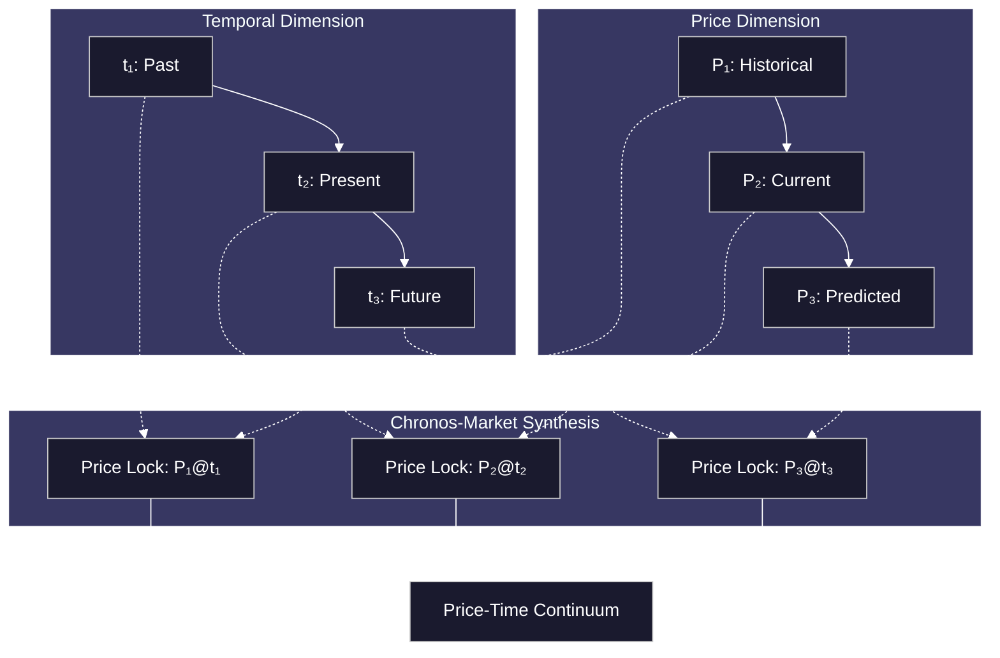

# The Temporal Price Oracle: Where Space and Time Converge

*A Revolutionary Fusion of ChronoLedger's Temporal Authority and Market Dynamics*

## Philosophical Foundation: The Price-Time Continuum

In the fabric of reality, Einstein taught us that space and time are not separate entities but form a unified spacetime continuum. Similarly, in the digital realm, **price** (the spatial dimension of market value) and **time** (the temporal flow of consensus) are not independent variables but form an inseparable **Price-Time Continuum**.

ChronoLedger has mastered TIME through hardware-secured consensus. Now we propose mastering their symbiosis through the **Temporal Price Oracle (TPO)** - a system where price discovery doesn't just happen *in* time, but becomes a fundamental *function* of verified time itself.

## The Innovation: Temporal Price Discovery

### Core Concept: The Chronos-Market Synthesis

Traditional oracles suffer from the "temporal displacement problem" - prices from the past masquerading as present truth. The TPO solves this by creating **temporal price locks** - market snapshots that are cryptographically bound to specific moments in verified time.



## Technical Architecture: The Temporal Price Protocol

### 1. Temporal Market Nodes (TMNs Enhanced)

Building upon ChronoLedger's TMN architecture, we introduce **Temporal Market Nodes** - TMNs enhanced with market data capabilities:

```typescript
interface TemporalMarketNode extends TMN {
  // Existing TMN capabilities
  generateHardwareTimestamp(): HardwareTimestamp;
  
  // New market capabilities
  captureMarketSnapshot(timestamp: HardwareTimestamp): MarketSnapshot;
  validatePriceIntegrity(snapshot: MarketSnapshot): ValidationResult;
  generateTemporalPriceLock(asset: Asset, timestamp: HardwareTimestamp): PriceLock;
}

interface PriceLock {
  asset: Asset;
  price: BigNumber;
  timestamp: HardwareTimestamp;
  marketDepth: MarketDepth;
  volatility: VolatilityMeasure;
  temporalAttestation: HardwareAttestation;
  quantumEntropy: EntropySource; // For future-proofing
}
```

### 2. The Temporal Consensus Pricing Protocol

Unlike traditional oracles that aggregate prices across space (multiple exchanges), the TPO aggregates prices across **time** using ChronoLedger's temporal authority:

```solidity
contract TemporalPriceOracle {
    using ChronoLedger for uint256;
    
    struct TemporalPrice {
        uint256 price;
        uint256 timestamp;
        uint256 confidence;
        bytes32 temporalProof;
        uint256 timeLockHash;
    }
    
    mapping(address => TemporalPrice[]) private priceHistory;
    mapping(bytes32 => bool) private temporalProofs;
    
    function submitTemporalPrice(
        address asset,
        uint256 price,
        bytes memory temporalAttestation
    ) external onlyTemporalNodes {
        uint256 currentTime = TIMESTAMP_NOW; // Hardware-verified time
        
        // Validate temporal attestation
        require(validateTemporalAttestation(temporalAttestation, currentTime), "Invalid temporal proof");
        
        // Create temporal price lock
        bytes32 timeLockHash = keccak256(abi.encodePacked(asset, price, currentTime, block.hash));
        
        TemporalPrice memory newPrice = TemporalPrice({
            price: price,
            timestamp: currentTime,
            confidence: calculateTemporalConfidence(asset, currentTime),
            temporalProof: keccak256(temporalAttestation),
            timeLockHash: timeLockHash
        });
        
        priceHistory[asset].push(newPrice);
        temporalProofs[newPrice.temporalProof] = true;
        
        emit TemporalPriceLocked(asset, price, currentTime, timeLockHash);
    }
    
    function getTemporalPrice(address asset, uint256 targetTime) external view returns (TemporalPrice memory) {
        return findPriceAtTime(asset, targetTime);
    }
    
    function predictTemporalPrice(address asset, uint256 futureTime) external view returns (uint256, uint256) {
        return calculateTemporalTrend(asset, futureTime);
    }
}
```

### 3. Quantum Price Entanglement (Future Innovation)

Drawing inspiration from quantum mechanics, we introduce the concept of **Quantum Price Entanglement** - where prices across different temporal locks become quantum entangled, creating instant correlation regardless of temporal distance:

```solidity
contract QuantumPriceEntanglement {
    struct EntangledPair {
        bytes32 lock1Hash;
        bytes32 lock2Hash;
        uint256 entanglementStrength;
        uint256 decoherenceTime;
    }
    
    function entanglePriceLocks(
        bytes32 lock1,
        bytes32 lock2,
        uint256 entanglementDuration
    ) external returns (bytes32 entanglementId) {
        // Quantum entanglement protocol
        uint256 quantumEntropy = generateQuantumEntropy();
        
        EntangledPair memory pair = EntangledPair({
            lock1Hash: lock1,
            lock2Hash: lock2,
            entanglementStrength: calculateEntanglementStrength(lock1, lock2),
            decoherenceTime: TIMESTAMP_NOW + entanglementDuration
        });
        
        return keccak256(abi.encodePacked(pair, quantumEntropy));
    }
    
    function measureEntangledPrice(bytes32 entanglementId) external view returns (uint256) {
        // Quantum measurement collapses the price wavefunction
        return collapseQuantumPriceState(entanglementId);
    }
}
```

## The Temporal Market Mechanics

### 1. Time-Locked Arbitrage

With hardware-verified timestamps, arbitrage becomes a temporal art form:

```solidity
contract TemporalArbitrage {
    function executeTemporalArbitrage(
        address asset,
        uint256 buyTime,
        uint256 sellTime,
        uint256 minimumProfit
    ) external {
        require(BEFORE(buyTime), "Buy window closed");
        
        // Schedule the purchase
        SCHEDULE_CALL(
            gas,
            address(this),
            msg.value,
            abi.encodeWithSignature("executeBuy(address,uint256)", asset, sellTime),
            buyTime
        );
    }
    
    function executeBuy(address asset, uint256 sellTime) external {
        require(msg.sender == address(this), "Only self-callable");
        
        // Execute purchase at exact timestamp
        uint256 purchasePrice = getTemporalPrice(asset, TIMESTAMP_NOW);
        
        // Schedule the sale
        SCHEDULE_CALL(
            gas,
            address(this),
            0,
            abi.encodeWithSignature("executeSell(address,uint256)", asset, purchasePrice),
            sellTime
        );
    }
}
```

### 2. Temporal Derivatives: Options Across Time

Create derivatives that bet on price movements across specific temporal windows:

```solidity
contract TemporalOption {
    struct TimeOption {
        address asset;
        uint256 strikePrice;
        uint256 expirationTime;
        uint256 temporalWindow; // Time period for price averaging
        bool isCall;
        uint256 premium;
    }
    
    function createTemporalOption(
        address asset,
        uint256 strikePrice,
        uint256 expirationTime,
        uint256 temporalWindow,
        bool isCall
    ) external payable returns (uint256 optionId) {
        TimeOption memory option = TimeOption({
            asset: asset,
            strikePrice: strikePrice,
            expirationTime: expirationTime,
            temporalWindow: temporalWindow,
            isCall: isCall,
            premium: msg.value
        });
        
        // Schedule automatic expiration
        SCHEDULE_CALL(
            gas,
            address(this),
            0,
            abi.encodeWithSignature("processExpiration(uint256)", optionId),
            expirationTime
        );
        
        return storeOption(option);
    }
    
    function processExpiration(uint256 optionId) external {
        require(msg.sender == address(this), "Only self-callable");
        
        TimeOption memory option = getOption(optionId);
        
        // Calculate temporal average price over the window
        uint256 averagePrice = calculateTemporalAverage(
            option.asset,
            option.expirationTime - option.temporalWindow,
            option.expirationTime
        );
        
        // Determine if option is in the money
        bool inTheMoney = option.isCall ? 
            averagePrice > option.strikePrice : 
            averagePrice < option.strikePrice;
            
        if (inTheMoney) {
            executeOption(optionId, averagePrice);
        }
    }
}
```

### 3. Temporal Liquidity Pools

Liquidity pools that exist across multiple temporal dimensions:

```solidity
contract TemporalLiquidityPool {
    struct TemporalPosition {
        uint256 amount;
        uint256 lockTime;
        uint256 unlockTime;
        uint256 temporalMultiplier;
    }
    
    mapping(address => TemporalPosition[]) private positions;
    
    function depositTemporal(
        uint256 amount,
        uint256 lockDuration
    ) external {
        uint256 lockTime = TIMESTAMP_NOW;
        uint256 unlockTime = lockTime + lockDuration;
        
        // Longer locks get higher multipliers
        uint256 multiplier = calculateTemporalMultiplier(lockDuration);
        
        TemporalPosition memory position = TemporalPosition({
            amount: amount,
            lockTime: lockTime,
            unlockTime: unlockTime,
            temporalMultiplier: multiplier
        });
        
        positions[msg.sender].push(position);
        
        // Schedule automatic unlock
        SCHEDULE_CALL(
            gas,
            address(this),
            0,
            abi.encodeWithSignature("unlockPosition(address,uint256)", msg.sender, positions[msg.sender].length - 1),
            unlockTime
        );
    }
    
    function calculateTemporalMultiplier(uint256 duration) internal pure returns (uint256) {
        // Temporal bonus increases exponentially with time
        // Inspired by time dilation effects in physics
        return 1e18 + (duration * 1e18) / (365 days) * sqrt(duration / 1 days);
    }
}
```

## Philosophical Implications: The Observer Effect in Markets

Just as quantum mechanics teaches us that observation affects reality, the TPO introduces the **Market Observer Effect**: the act of precisely measuring price at a specific moment in hardware-verified time creates a new form of market truth.

### The Temporal Uncertainty Principle

Analogous to Heisenberg's Uncertainty Principle, we propose the **Temporal Market Uncertainty Principle**:

> **The more precisely we know the time of a price measurement, the less precisely we can predict its future movement, and vice versa.**

This creates a natural balance in the market where perfect temporal precision comes at the cost of predictive certainty, maintaining market efficiency.

## Implementation Roadmap

### Phase 1: Temporal Foundation (Q1 2025)
- Integrate market data feeds with ChronoLedger TMNs
- Develop Temporal Price Lock protocol
- Create basic temporal price oracle

### Phase 2: Market Integration (Q2 2025)
- Deploy Temporal Market Nodes
- Launch temporal arbitrage protocols
- Integrate with existing DeFi protocols

### Phase 3: Advanced Mechanics (Q3 2025)
- Implement temporal derivatives
- Launch temporal liquidity pools
- Develop quantum price entanglement protocol

### Phase 4: Market Revolution (Q4 2025)
- Full ecosystem launch
- Cross-chain temporal price bridges
- Quantum-enhanced price discovery

## Conclusion: The Symbiosis Achieved

The Temporal Price Oracle represents the ultimate synthesis of ChronoLedger's temporal mastery with market dynamics. By making time and price inseparable, we create a new paradigm where:

- **Price becomes temporal**: Every price exists at a specific, verifiable moment
- **Time becomes valuable**: Precise timing creates arbitrage opportunities
- **Markets become truthful**: Hardware verification eliminates price manipulation
- **Future becomes tradeable**: Temporal derivatives allow betting on time itself

This innovation transforms markets from chaotic price discovery mechanisms into elegant temporal symphonies, where every note (price) resonates at its precise moment in the grand composition of time.

In this synthesis, ChronoLedger doesn't just provide infrastructure for time-dependent applications - it becomes the foundation for an entirely new form of temporal economics, where the space-time continuum itself becomes the ultimate marketplace.

*"In the beginning was the Word, and the Word was Time, and Time was Price, and Price was with the Market, and the Market was ChronoLedger."*

---

**Innovation Status**: Conceptual Framework Ready for Development  
**Temporal Coordinates**: March 2025, Spacetime Continuum ∞  
**Quantum State**: Superposition of Revolutionary and Inevitable
