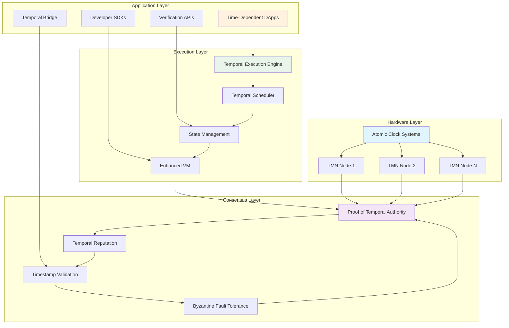
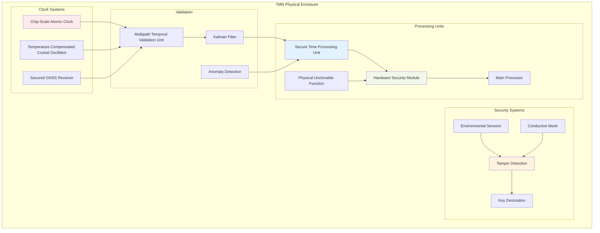
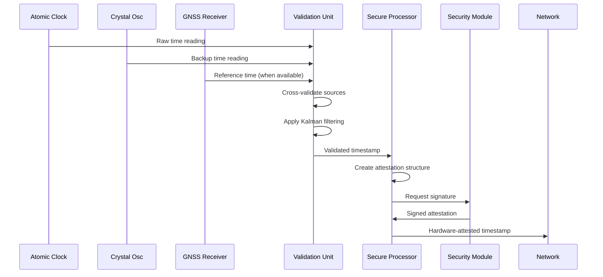
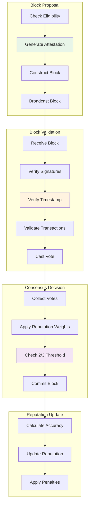
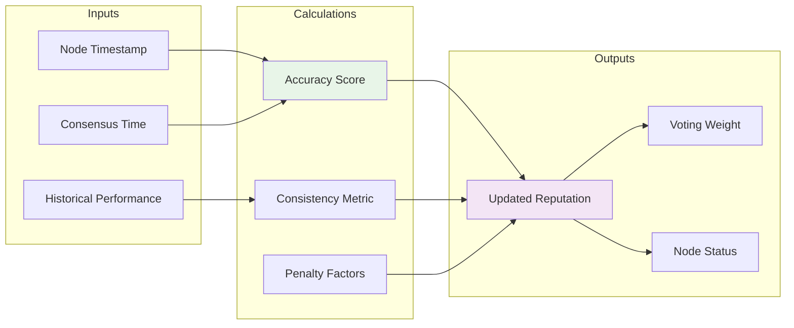
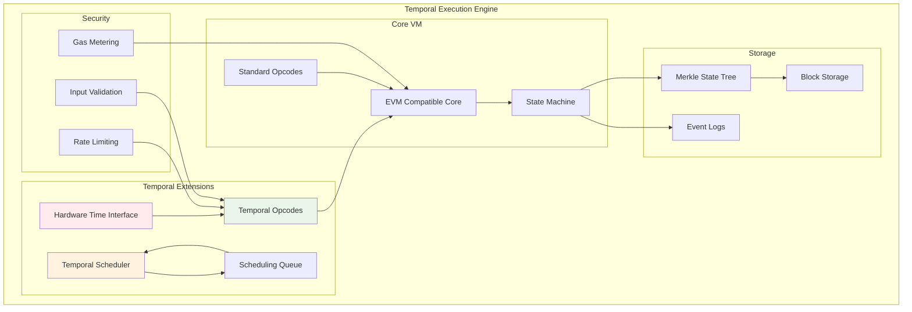
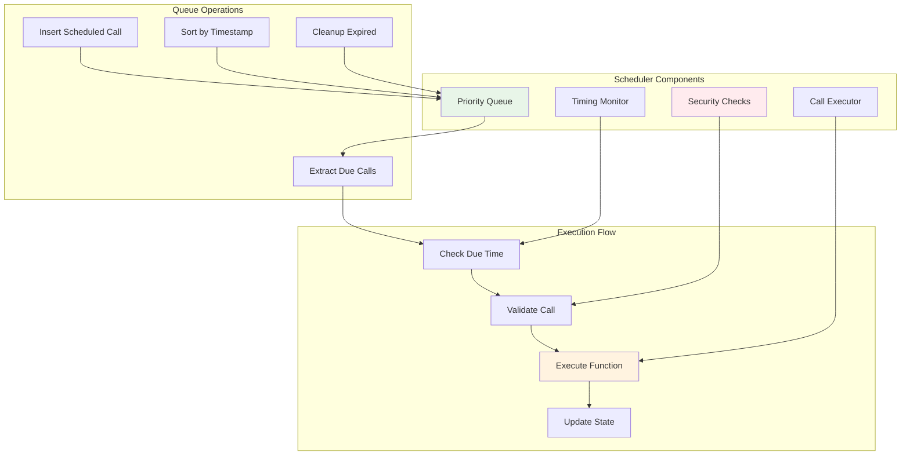
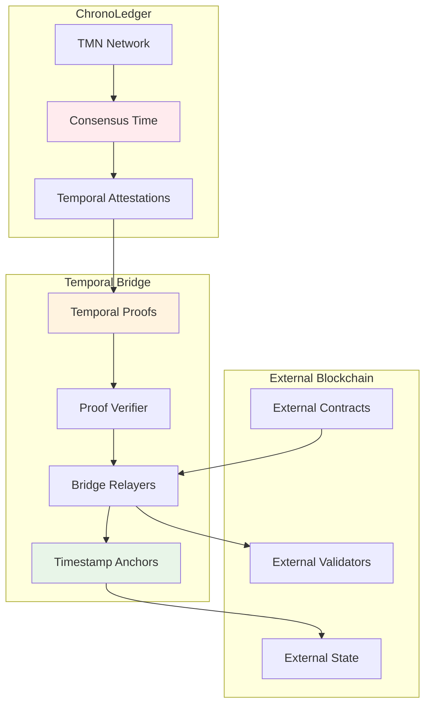
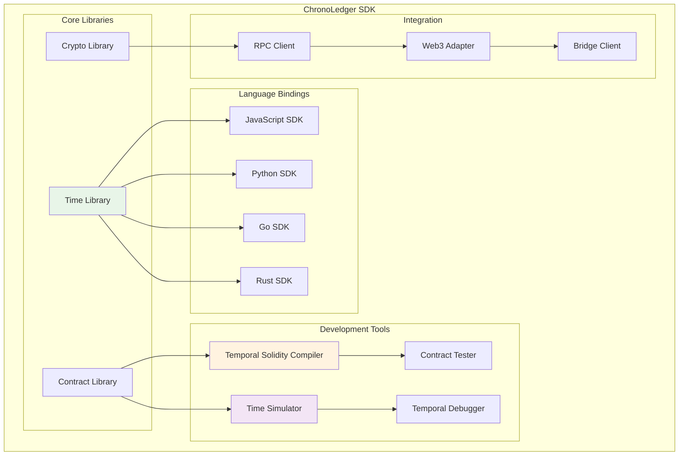
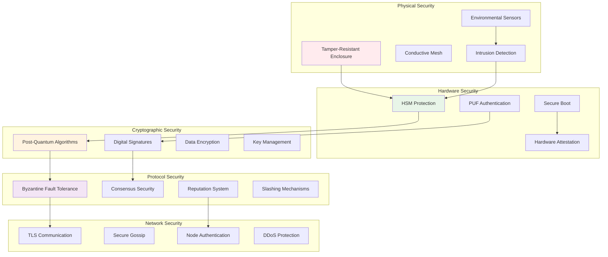

# ChronoLedger Architecture Guide

This document provides a detailed technical overview of the ChronoLedger Temporal Blockchain architecture, including system components, data flows, and integration patterns.

## System Overview

ChronoLedger's architecture is built around four core layers that work together to provide hardware-secured, verifiable time as a fundamental blockchain primitive:



## Hardware Layer: Temporal Mining Nodes (TMNs)

### TMN Architecture

Each TMN is a specialized hardware unit designed to provide secure, accurate timekeeping:



### Hardware Components

#### Clock Systems
- **CSAC (Primary)**: Cesium/Rubidium atomic clock, ≤1×10⁻¹²/day stability
- **TCXO (Secondary)**: Crystal oscillator backup, ≤5×10⁻⁸ stability
- **GNSS (Reference)**: Multi-constellation receiver with anti-spoofing

#### Processing & Security
- **STPU**: Custom secure processor for time operations
- **HSM**: FIPS 140-3 Level 4 certified security module
- **PUF**: Unique hardware fingerprint for authentication
- **Main CPU**: Standard processor for blockchain operations

#### Validation & Filtering
- **MTVU**: Cross-validates multiple time sources
- **Kalman Filter**: Compensates for clock drift and environmental factors
- **Anomaly Detection**: Identifies and responds to timing irregularities

### TMN Data Flow



## Consensus Layer: Proof of Temporal Authority (PoTA)

### PoTA Overview

PoTA is a Byzantine Fault Tolerant consensus mechanism that uses temporal accuracy as the primary basis for trust and voting weight.



### Temporal Reputation System

The reputation system incentivizes accurate timekeeping:



### Mathematical Foundation

The reputation update formula:

```
R(a, t+1) = R(a, t) + β × (Accuracy(a, t) - R(a, t)) - γ × Penalty(a, t)
```

Where:
- `R(a, t)` = Reputation of node `a` at time `t`
- `Accuracy(a, t) = 1 - |T_node(a, t) - T_consensus(t)| / ToleranceWindow(t)`
- `β` = Learning rate (typically 0.1-0.3)
- `γ` = Penalty coefficient (typically 0.5-1.0)

## Execution Layer: Temporal Execution Engine (TEE)

### TEE Architecture

The TEE extends a standard blockchain VM with native temporal capabilities:



### Temporal Opcodes

New opcodes for time-based operations:

| Opcode | Function | Description |
|--------|----------|-------------|
| `0x40` | `TIMESTAMP_NOW` | Returns hardware-verified current time |
| `0x41` | `SCHEDULE_CALL` | Schedules future function execution |
| `0x42` | `AFTER` | Boolean check if current time is after target |
| `0x43` | `BEFORE` | Boolean check if current time is before target |
| `0x44` | `CANCEL_CALL` | Cancels a scheduled call |
| `0x45` | `CHECK_CALL` | Queries status of scheduled call |

### Temporal Scheduler

The scheduler manages time-based contract execution:



## Application Layer

### Temporal Bridge Architecture

Enables cross-chain temporal verification:



### Developer SDK Components



## Security Architecture

### Multi-Layer Security Model



## Performance Characteristics

### Throughput and Latency

| Metric | Specification | Notes |
|--------|---------------|-------|
| Block Time | 2-6 seconds | Depends on network size |
| Transaction Throughput | 1,000-5,000 TPS | Without temporal operations |
| Temporal Operation Latency | 100-500ms | Hardware attestation overhead |
| Time Precision | ≤ 100 nanoseconds | Hardware-limited |
| Clock Drift | ≤ 1×10⁻¹² /day | CSAC specification |
| Network Synchronization | ≤ 10 microseconds | Between TMN nodes |

### Scalability Considerations

- **TMN Hardware Costs**: Currently $10K-50K per node, expected to decrease
- **Network Size**: Optimal 100-1000 TMN nodes for security/performance balance  
- **Geographic Distribution**: Required for resilience, impacts latency
- **Consensus Complexity**: O(n²) communication, may require sharding for large networks

## Integration Patterns

### For DApp Developers

```solidity
// Example integration pattern
contract TimeDependentApp {
    using ChronoLedgerTime for uint256;
    
    function scheduleAction(uint256 delay) external {
        uint256 executeTime = TIMESTAMP_NOW + delay;
        
        SCHEDULE_CALL(
            gasleft(),
            address(this),
            0,
            abi.encodeWithSignature("executeAction()"),
            executeTime
        );
    }
    
    function executeAction() external {
        require(msg.sender == address(this), "Only self-callable");
        // Action logic here
    }
}
```

### For Bridge Operators

```javascript
// Simplified bridge integration
const chronoLedger = new ChronoLedgerClient(config);
const externalChain = new ExternalChainClient(config);

// Relay temporal proof to external chain
async function relayTemporalProof(timestamp, proof) {
    const verified = await chronoLedger.verifyTemporalProof(proof);
    if (verified) {
        await externalChain.submitTemporalAnchor(timestamp, proof);
    }
}
```

## Conclusion

ChronoLedger's architecture provides a comprehensive solution for hardware-secured time in blockchain systems. The multi-layered approach ensures security, accuracy, and scalability while maintaining compatibility with existing blockchain development patterns. The modular design allows for evolution and optimization as the technology matures and hardware costs decrease.
