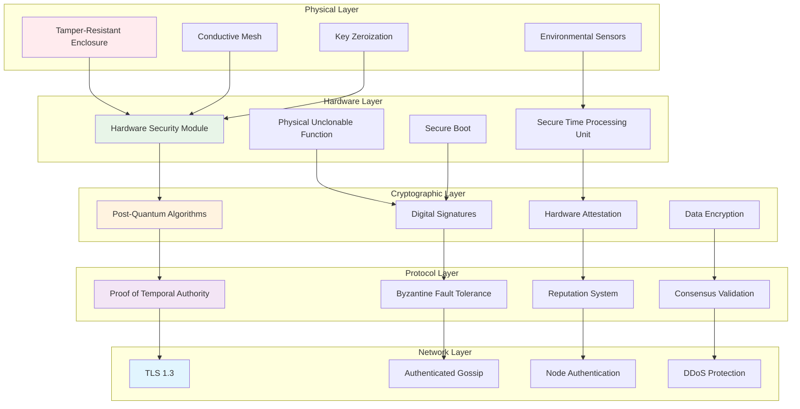
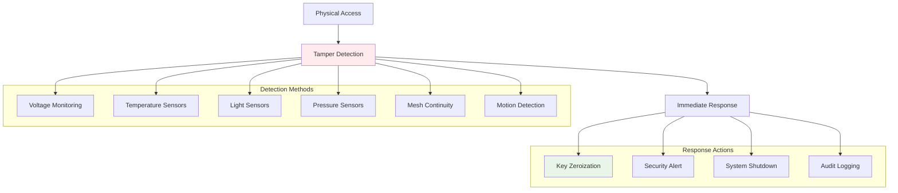

# ChronoLedger Security Analysis

This document provides a comprehensive security analysis of the ChronoLedger Temporal Blockchain, including threat models, attack vectors, mitigations, and security guarantees.

## Executive Summary

ChronoLedger's security model is built on multiple layers of protection, from physical hardware security to cryptographic protocols. The system is designed to resist sophisticated attacks including time manipulation, hardware tampering, and network-level attacks while maintaining Byzantine fault tolerance and long-term security guarantees.

## Threat Model

### Adversary Capabilities

We assume an adversary with the following capabilities:

#### Network-Level Capabilities
- Control over network infrastructure (ISPs, routing)
- Ability to perform man-in-the-middle attacks
- DDoS attack capabilities
- Eclipse attack capabilities (isolating nodes)
- Traffic analysis and timing correlation

#### Computational Capabilities
- High computational resources (but not unlimited)
- Cannot break cryptographic assumptions (discrete log, factoring, post-quantum hard problems)
- Access to quantum computers (for future threat analysis)
- Ability to perform side-channel attacks

#### Physical Access Capabilities
- Physical access to some TMN hardware units
- Sophisticated hardware analysis tools
- Ability to perform fault injection attacks
- Access to supply chain (limited)
- Environmental manipulation capabilities

#### Social Engineering Capabilities
- Ability to compromise some system operators
- Access to insider information
- Ability to bribe or coerce participants

### Assets Under Protection

#### Primary Assets
1. **Chain Time Integrity**: The accuracy and immutability of the consensus time
2. **Temporal Attestations**: Hardware-signed timestamp proofs
3. **Private Keys**: TMN signing keys and HSM-protected material
4. **Consensus Integrity**: The overall consensus mechanism
5. **Smart Contract Execution**: Proper execution of temporal contracts

#### Secondary Assets
1. **Network Availability**: Continued operation of the network
2. **Node Reputation**: Individual node temporal reputation scores
3. **Configuration Data**: Network parameters and settings
4. **Historical Data**: Past blocks and temporal records

## Security Architecture

### Multi-Layer Defense Model

## Attack Vectors and Mitigations

### 1. Time Manipulation Attacks

#### Attack: GPS Spoofing
**Description**: Adversary broadcasts fake GPS signals to manipulate GNSS-based time references.

**Impact**: Could skew initial time calibration or drift correction.

**Mitigations**:
- Multi-constellation GNSS receivers with anti-spoofing
- Primary reliance on internal atomic clocks, not GNSS
- Cryptographic authentication of GNSS signals where available
- Cross-validation with multiple time sources via MTVU
- Anomaly detection for unrealistic time jumps

#### Attack: NTP Manipulation
**Description**: Compromise of Network Time Protocol servers or man-in-the-middle attacks on NTP traffic.

**Impact**: Could affect time references for systems that still use NTP.

**Mitigations**:
- ChronoLedger does not rely on NTP for consensus time
- TMNs use hardware atomic clocks as primary time source
- Any external time references are used only for calibration verification
- Authenticated time sources where external references are used

#### Attack: Atomic Clock Drift Exploitation
**Description**: Exploiting natural atomic clock drift to gradually skew network time.

**Mitigations**:
- Continuous drift monitoring and compensation via Kalman filtering
- Cross-validation between multiple independent atomic clocks
- Reputation penalties for nodes with excessive drift
- Periodic recalibration events with external high-precision references

#### Attack: Coordinated Time Attack
**Description**: Multiple compromised nodes report coordinated false timestamps.

**Mitigations**:
- Byzantine fault tolerance requiring >2/3 honest weight
- Temporal reputation system makes new attacks costly
- Hardware attestation requirements make mass compromise difficult
- Anomaly detection for coordinated deviations

### 2. Hardware-Level Attacks

#### Attack: Physical Tampering
**Description**: Physical access to TMN hardware to extract keys or manipulate clocks.

**Mitigations**:

#### Attack: Side-Channel Analysis
**Description**: Extracting secrets through power analysis, electromagnetic emanations, or timing analysis.

**Mitigations**:
- STPU and HSM designed with side-channel resistance
- Power line filtering and electromagnetic shielding
- Randomized timing and power consumption patterns
- Secure key storage within HSM boundaries
- Physical separation of sensitive operations

#### Attack: Fault Injection
**Description**: Using electromagnetic pulses, voltage glitches, or laser attacks to cause computational faults.

**Mitigations**:
- Fault detection in STPU and HSM
- Redundant computation verification
- Environmental monitoring for attack indicators
- Error correction and integrity checking
- Immediate shutdown upon fault detection

#### Attack: Supply Chain Compromise
**Description**: Compromise of TMN hardware during manufacturing or distribution.

**Mitigations**:
- Secure supply chain with trusted vendors
- Hardware verification upon receipt
- Secure boot with verified firmware
- PUF-based hardware authentication
- Regular integrity checking and attestation

### 3. Cryptographic Attacks

#### Attack: Quantum Computer Attacks
**Description**: Future quantum computers breaking current cryptographic algorithms.

**Mitigations**:
- Implementation of post-quantum cryptographic algorithms:
  - **Signatures**: CRYSTALS-Dilithium, Falcon, SPHINCS+
  - **Key Exchange**: CRYSTALS-Kyber
  - **Hashing**: SHA-3, SHAKE
- Crypto-agility for algorithm updates
- Hybrid classical/post-quantum schemes during transition
- Long-term planning for quantum threat timeline

#### Attack: Private Key Compromise
**Description**: Extraction or compromise of TMN private keys.

**Mitigations**:
- Keys never leave HSM boundary
- PUF-based key derivation tied to specific hardware
- Key rotation capabilities
- Multi-factor authentication for key operations
- Immediate revocation upon compromise detection

#### Attack: Signature Forgery
**Description**: Attempting to forge hardware attestation signatures.

**Mitigations**:
- Strong signature algorithms (post-quantum resistant)
- Hardware-bound signing keys (PUF-derived)
- Timestamp verification independent of signature
- Multi-signature requirements for critical operations

### 4. Network-Level Attacks

#### Attack: Eclipse Attacks
**Description**: Isolating a node from the honest network by controlling its connections.

**Mitigations**:
- Diverse connection strategies (geographic, network diversity)
- Out-of-band communication channels
- Peer diversity requirements
- Connection monitoring and alerting
- Secure offline operation capability during isolation

#### Attack: DDoS Attacks
**Description**: Overwhelming nodes with traffic to disrupt consensus.

**Mitigations**:
- Rate limiting on incoming connections
- Computational puzzles for resource-intensive operations
- Traffic prioritization for consensus messages
- Redundant network paths
- Geographic distribution of nodes

#### Attack: Man-in-the-Middle
**Description**: Intercepting and potentially modifying network communications.

**Mitigations**:
- End-to-end encryption (TLS 1.3)
- Authenticated gossip protocols
- Certificate pinning for known nodes
- Message integrity verification
- Detection of certificate anomalies

### 5. Consensus-Level Attacks

#### Attack: Long-Range Attacks
**Description**: Creating alternative history from an earlier point in the chain.

**Mitigations**:
- Checkpointing mechanisms with external anchoring
- Temporal anchoring to other blockchains
- Social consensus for deep reorg protection
- Stake-based finality mechanisms (if applicable)
- Hardware timestamps make past forgery difficult

#### Attack: Nothing-at-Stake
**Description**: Validators supporting multiple chain forks simultaneously.

**Mitigations**:
- Slashing for equivocation
- Temporal reputation penalties
- Clear fork choice rules based on temporal accuracy
- Economic incentives for honest behavior

#### Attack: Sybil Attacks
**Description**: Creating many fake identities to influence consensus.

**Mitigations**:
- Hardware requirements create high barriers to entry
- PUF-based identity tied to physical hardware
- Temporal reputation requirements for influence
- Economic cost of TMN hardware
- Gradual reputation building requirements

## Security Guarantees

### Temporal Security Properties

#### 1. Temporal Integrity
**Guarantee**: Chain Time accurately reflects the passage of real-world time within specified bounds.

**Formal Statement**: For any block B with timestamp T, the real-world time when B was created is within [T - ε, T + ε] where ε is the network precision bound.

**Assumptions**: 
- >2/3 of voting weight is controlled by honest TMNs
- Hardware clocks operate within specification
- Network latency is bounded

#### 2. Temporal Consistency
**Guarantee**: Timestamps are monotonically increasing and consistent across the network.

**Formal Statement**: For any two blocks B₁ and B₂ where B₁ precedes B₂, timestamp(B₁) < timestamp(B₂).

#### 3. Temporal Non-Repudiation
**Guarantee**: Hardware-attested timestamps cannot be forged or repudiated.

**Formal Statement**: Any timestamp T with valid hardware attestation A was generated by authentic TMN hardware at real-world time T ± precision.

### Byzantine Fault Tolerance

#### Safety Property
**Guarantee**: No two honest nodes will commit conflicting blocks at the same height.

**Formal Statement**: If honest nodes commit blocks B₁ and B₂ at height h, then B₁ = B₂.

**Threshold**: Safety guaranteed when malicious voting weight < 1/3 total weight.

#### Liveness Property
**Guarantee**: The network will continue to make progress and commit new blocks.

**Formal Statement**: Under synchronous network conditions, a new block will be committed within bounded time.

**Threshold**: Liveness guaranteed when malicious voting weight < 1/3 total weight.

### Cryptographic Security

#### Computational Security
**Guarantee**: Breaking cryptographic primitives requires computationally infeasible effort.

**Assumptions**:
- Discrete logarithm problem is hard
- Post-quantum assumptions hold
- Hash functions are collision-resistant
- PRFs are pseudorandom

#### Information-Theoretic Security
**Guarantee**: Some components provide unconditional security regardless of computational power.

**Examples**:
- PUF responses (with sufficient entropy)
- One-time pad elements (where applicable)
- Information-theoretic MACs

## Security Testing and Validation

### Penetration Testing
Regular security assessments including:
- Hardware penetration testing
- Network security assessment
- Cryptographic implementation review
- Side-channel analysis
- Fault injection testing

### Formal Verification
Mathematical proofs of security properties:
- Consensus algorithm correctness
- Cryptographic protocol security
- Temporal property verification
- Byzantine fault tolerance proofs

### Security Audits
Independent third-party security reviews:
- Code audits by security specialists
- Hardware design reviews
- Cryptographic implementation audits
- Overall system architecture review

## Incident Response

### Detection Capabilities
- Real-time monitoring of temporal accuracy
- Hardware tamper detection
- Network anomaly detection
- Cryptographic integrity checking
- Consensus deviation alerts

### Response Procedures
1. **Immediate**: Isolate compromised components
2. **Short-term**: Assess impact and implement mitigations
3. **Medium-term**: Investigate root cause and patch vulnerabilities
4. **Long-term**: Update security measures and procedures

### Recovery Mechanisms
- Key rotation and replacement
- Hardware replacement procedures
- Network reconfiguration
- Consensus recovery protocols
- State synchronization procedures

## Conclusion

ChronoLedger's security model provides strong guarantees for temporal integrity through multiple layers of protection. The combination of hardware security, cryptographic protection, and protocol-level defenses creates a robust system capable of resisting sophisticated attacks while maintaining the temporal accuracy required for high-assurance applications.

The security analysis demonstrates that ChronoLedger can achieve its security goals under reasonable assumptions about adversary capabilities and system parameters. Ongoing security monitoring, testing, and updates will be essential to maintain these guarantees as the system evolves and new threats emerge.

---

*Security analysis current as of March 2025. Regular updates will be provided as the system develops and new threats are identified.*
