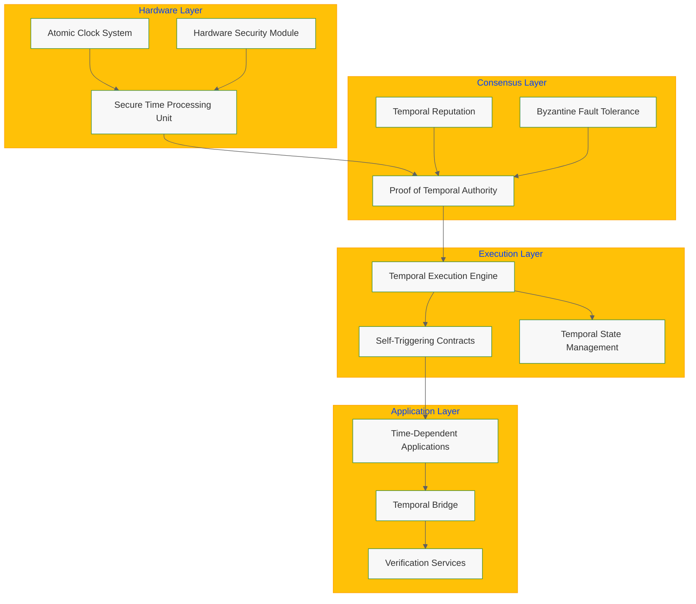

# Temporal Blockchain: Hardware-Secured Time for Trustless Systems

**ChronoLedger Systems Whitepaper v1.0**

*Paul E. Lowndes*  
*ZeroTrust@NSHkr.com*  
*March 5, 2025*

## Abstract

This whitepaper introduces the Temporal Blockchain, a novel distributed ledger technology that integrates hardware-secured timekeeping directly into its consensus mechanism. Unlike traditional blockchain systems that treat time as an external parameter subject to manipulation, the Temporal Blockchain elevates time to a first-class structural element through specialized Temporal Mining Nodes (TMNs) equipped with chip-scale atomic clocks and tamper-resistant hardware security modules. This innovation enables a new consensus protocol—Proof of Temporal Authority (PoTA)—that achieves Byzantine fault tolerance while preserving strong temporal guarantees. The system supports native time-based capabilities including self-triggering smart contracts, secure offline operation, and cross-chain temporal verification. These advancements address critical limitations in existing blockchain architectures, enabling new classes of applications that depend on trustless temporal awareness, such as time-locked financial instruments, deadline-enforcing governance systems, and secure timestamp verification for digital evidence.

## 1. Introduction

### 1.1 The Problem of Time in Distributed Systems

Time synchronization remains one of the most challenging problems in distributed systems. While traditional blockchains have revolutionized trust in distributed computing, they have largely sidestepped the challenge of trustless temporal awareness. Most blockchain systems rely on block timestamps that are:

- Subjectively determined by miners or validators
- Not cryptographically verifiable as accurate
- Vulnerable to manipulation within certain bounds
- Not precise enough for many time-sensitive applications

These limitations create a trust gap in time-dependent applications, forcing them to rely on centralized time oracles or accept weakened time guarantees.

### 1.2 Existing Approaches and Their Limitations

Current approaches to handling time in blockchain systems include:

**Block Timestamps**: Determined by block proposers, typically only required to be greater than the previous block's timestamp, often manipulable within several minutes, and lack cryptographic attestation of accuracy.

**External Oracles**: Introduce centralization and trust assumptions, create single points of failure, increase operational complexity, and often lack hardware security guarantees.

**Verifiable Delay Functions (VDFs)**: Provide relative ordering rather than absolute time, cannot prove that a specific wall-clock time has occurred, and require trust in the VDF setup and parameters.

### 1.3 Our Contribution

The Temporal Blockchain represents a fundamental paradigm shift by solving the critical problem of trustless temporal awareness. Key innovations include:

1. **Hardware-Secured Time Layer**: Specialized Temporal Mining Nodes with multi-layered hardware clock systems
2. **Proof of Temporal Authority**: A novel consensus mechanism that weaves temporal accuracy into network trust
3. **Self-Triggering Smart Contracts**: Native temporal execution capabilities
4. **Secure Offline Operation**: Continued operation with verifiable timestamps when disconnected
5. **Cross-Chain Temporal Verification**: Bridge protocols enabling other blockchains to leverage temporal guarantees

## 2. System Architecture

The Temporal Blockchain comprises four primary architectural layers:

### 2.1 Core System Layers

1. **Hardware-Secured Time Layer**: Physical source of trusted time within each TMN
2. **Temporal Consensus Layer**: Implements Proof of Temporal Authority (PoTA) consensus
3. **Temporal Execution Layer**: Enhanced VM with native temporal capabilities 
4. **Application Layer**: APIs, SDKs, and interfaces for users and developers

### 2.2 Data Flow Architecture



## 3. Temporal Mining Nodes (TMNs)

TMNs are specialized hardware units that serve as the foundation of the Temporal Blockchain's security model.

### 3.1 Hardware Architecture

Each TMN features:

**Multi-Layered Hardware Clock System**:
- Primary: Chip-Scale Atomic Clock (CSAC) - Cesium/Rubidium, Stability ≤ 1×10⁻¹²/day
- Secondary: Temperature-Compensated Crystal Oscillator (TCXO)
- Secured GNSS Receiver with anti-spoofing/jamming capabilities
- Multipath Temporal Validation Unit (MTVU) for cross-validation and drift compensation

**Secure Time Processing Unit (STPU)**:
- Custom silicon with secure execution environment
- Clock management and anomaly detection
- Cryptographic attestation generation/verification
- Side-channel and fault injection resistance

**Hardware Security Module (HSM)**:
- FIPS 140-3 Level 4 certified
- Secure key storage and crypto operations
- Post-quantum algorithm support
- Physical tamper detection and response

**Physical Unclonable Function (PUF)**:
- Silicon-based unique hardware identity
- Tamper-evident authentication
- Key derivation capabilities

### 3.2 Physical Security Measures

TMNs are housed in tamper-resistant enclosures with:
- Multi-layer composite construction with conductive mesh
- IP67 environmental protection
- Comprehensive sensor array (pressure, temperature, light, motion)
- Automated key zeroization upon tamper detection

### 3.3 Temporal Attestation Process

1. **Acquisition**: STPU reads time from multiple clock sources
2. **Validation**: MTVU cross-validates and removes outliers
3. **Compensation**: Kalman filter corrects for drift
4. **Attestation**: STPU creates signed timestamp structure
5. **Signing**: HSM signs attestation with node's private key

## 4. Proof of Temporal Authority Consensus

PoTA is a novel Byzantine Fault Tolerant consensus mechanism designed specifically for the Temporal Blockchain.

### 4.1 Consensus Overview

PoTA achieves BFT by integrating hardware-secured time into the consensus process:

- **Hardware-Rooted Time**: Timestamp accuracy is the primary measure of trust
- **Temporal Reputation**: Nodes build reputation based on historical accuracy
- **Weighted Voting**: Voting power determined by temporal reputation
- **Dynamic Parameters**: Tolerance windows adapt to network conditions
- **Slashing**: Penalties enforce accurate timekeeping

### 4.2 Block Proposal Process

1. **Eligibility**: Nodes with sufficient reputation are eligible
2. **Timestamping**: Proposer generates hardware-attested timestamp
3. **Construction**: Block includes timestamp, transactions, proposer data
4. **Broadcast**: Block sent to network for validation

### 4.3 Block Validation Process

Validators perform comprehensive checks:
1. Verify proposer signature and eligibility
2. Verify cryptographic signature on timestamp
3. Compare timestamp to local hardware clock within tolerance window
4. Check temporal consistency and monotonicity
5. Validate all included transactions

### 4.4 Temporal Reputation System

Reputation incentivizes accuracy:

```
R(a, t+1) = R(a, t) + β × (Accuracy(a, t) - R(a, t)) - γ × Penalty(a, t)
```

Where:
- `Accuracy(a, t) = 1 - |T_node(a, t) - T_consensus(t)| / ToleranceWindow(t)`
- `β` (learning rate) and `γ` (penalty coefficient) control sensitivity

### 4.5 Slashing Mechanisms

Penalties for malicious behavior include:
- Reputation reduction for inaccurate timestamps
- Stake confiscation (if applicable)
- Temporary or permanent exclusion from consensus

## 5. Temporal Execution Engine

The TEE extends a standard blockchain VM with native temporal capabilities.

### 5.1 New Temporal Opcodes

- **`TIMESTAMP_NOW`**: Returns current consensus time with nanosecond precision
- **`SCHEDULE_CALL`**: Schedules future function execution at specific timestamp
- **`AFTER`/`BEFORE`**: Boolean conditionals for temporal logic
- **`CANCEL_SCHEDULE_CALL`**: Cancels pending scheduled calls
- **`CHECK_SCHEDULED_CALL`**: Queries status of scheduled calls

### 5.2 Self-Triggering Smart Contracts

Example temporal escrow contract:

```solidity
contract TemporalEscrow {
    address payable public seller;
    uint256 public releaseTime;

    constructor(address payable _seller, uint256 _lockDuration) payable {
        seller = _seller;
        releaseTime = TIMESTAMP_NOW + _lockDuration;
        
        // Schedule automatic release
        SCHEDULE_CALL(
            gas, 
            address(this), 
            0, 
            abi.encodeWithSignature("release()"), 
            releaseTime
        );
    }

    function release() public {
        require(msg.sender == address(this), "Only self-callable");
        require(TIMESTAMP_NOW >= releaseTime, "Too early");
        seller.transfer(address(this).balance);
    }
}
```

### 5.3 Temporal State Management

- **Scheduling Queue**: Persistent, ordered priority queue for pending calls
- **Execution**: TEE processes queue each block, executing due calls
- **State Integration**: Queue state included in block's Merkle root

## 6. Secure Offline Operation

TMNs can operate securely offline using internal atomic clocks and pre-shared cryptographic material.

### 6.1 Pre-Shared Initialization Vectors

Structure includes:
- Network consensus timestamp
- Random value for uniqueness
- HMAC signed by quorum of online TMNs
- Expiration time and node ID

### 6.2 Drift Compensation

- Kalman filtering using prior measurements and environmental data
- Continuous execution on STPU while offline
- Maintains accuracy over extended periods (< 100 μs drift over 30 days)

### 6.3 Offline Timestamp Generation

1. Read time from CSAC
2. Apply drift correction
3. Select next unused initialization vector
4. Create signed timestamp structure
5. Store securely until reconnection

## 7. Temporal Bridge

Enables interoperability with external blockchains.

### 7.1 Cross-Chain Communication

Supports multiple protocols:
- Light clients for direct verification
- Relay networks for data transfer
- Native protocols where available

### 7.2 Timestamp Anchoring

Periodically records Temporal Blockchain state on external chains:
- Block height, hash, timestamp, state root
- Aggregated signatures from TMN quorum
- Configurable frequency balancing latency and cost

### 7.3 Temporal Proof Verification

External chains verify timestamps using:
- Timestamp and block hash
- Merkle proof of inclusion
- Anchor proof linking to external chain
- Attestation signatures

## 8. Security Analysis

### 8.1 Threat Model

Assumes adversary capable of:
- Network control and high computation
- Compromising some nodes
- Physical access to some TMNs
- Cannot break cryptographic assumptions

### 8.2 Time Manipulation Attacks

Mitigated by:
- Hardware security (CSAC, STPU, HSM)
- PoTA consensus with reputation weighting
- Multi-source validation and drift compensation
- Anomaly detection and secured GNSS

### 8.3 Byzantine Fault Tolerance

PoTA ensures safety when faulty node weight < 1/3 total weight.
Reputation weighting minimizes impact of compromised nodes.

### 8.4 Hardware-Level Attacks

Protected by:
- Tamper-resistant enclosures
- Environmental monitoring
- Side-channel resistance in STPU/HSM
- Physical unclonable functions
- Secure boot and key zeroization

### 8.5 Quantum Resistance

Employs post-quantum algorithms:
- CRYSTALS-Dilithium for signatures
- Kyber for key exchange
- SHA-3 for hashing
- Ensures long-term security

## 9. Implementation Considerations

### 9.1 Hardware Production

- Sourcing specialized components (CSACs, secure elements)
- Secure manufacturing and distribution
- Quality control and certification
- Cost optimization strategies

### 9.2 Network Bootstrapping

- Genesis block anchored to external high-precision sources
- Founding node coordination and calibration
- Secure onboarding process for new nodes

### 9.3 Scalability

- Communication complexity optimization
- Reputation tracking efficiency
- Potential sharding approaches
- Transaction throughput considerations

### 9.4 Governance

- Parameter adjustment mechanisms
- Protocol upgrade procedures
- Temporal calibration event coordination
- Chain time re-anchoring decisions

## 10. Use Cases

### 10.1 Financial Applications

- **Regulatory Compliance**: MiFID II timestamp requirements
- **High-Frequency Trading**: Tamper-proof audit trails
- **Secure Settlement**: Precisely timed financial instruments
- **DeFi Derivatives**: Time-based automated execution

### 10.2 Critical Infrastructure

- **Resilient PNT**: GPS-independent timing
- **Secure Communications**: Network synchronization
- **Power Grid Coordination**: Precise timing for stability
- **5G/6G Networks**: Ultra-reliable timing

### 10.3 Digital Evidence

- **Legal Timestamps**: Irrefutable evidence dating
- **Intellectual Property**: Creation and modification proof
- **Long-term Archival**: Tamper-proof record keeping
- **Forensic Analysis**: Verifiable event sequences

### 10.4 Supply Chain

- **Proof of Custody**: Verifiable handoffs
- **Cold Chain Monitoring**: Temperature-time correlation
- **SLA Enforcement**: Automated penalty triggers
- **Provenance Tracking**: Complete timeline verification

## 11. Future Research

### 11.1 Advanced Hardware Integration

- Quantum time sources
- Further miniaturization of atomic clocks
- Novel tamper-resistance techniques
- Specialized ASIC development

### 11.2 Consensus Enhancements

- Hybrid mechanisms combining PoTA with other approaches
- Temporal sharding for improved scalability
- Advanced reputation algorithms
- Formal verification of consensus properties

### 11.3 Cross-Chain Coordination

- Unified time standards across blockchains
- Zero-knowledge temporal proofs
- Optimized bridge protocols
- Multi-chain temporal applications

## 12. Conclusion

The Temporal Blockchain fundamentally solves the problem of trustless time in distributed systems by integrating hardware-secured timekeeping into its core consensus and execution layers. Through TMNs, PoTA, and the TEE, it provides unparalleled accuracy, security, and functionality for time-sensitive applications. This innovation enables a new generation of decentralized systems where time is a verifiable, first-class element, underpinning trust and resilience across finance, governance, logistics, and beyond.

## References

1. Nakamoto, S. (2008). "Bitcoin: A Peer-to-Peer Electronic Cash System."
2. Buterin, V. (2014). "Ethereum: A Next-Generation Smart Contract and Decentralized Application Platform."
3. Castro, M., & Liskov, B. (1999). "Practical Byzantine Fault Tolerance." OSDI.
4. Yakovenko, A. (2018). "Solana: A new architecture for a high performance blockchain."
5. Fischer, M. J., et al. (1985). "Impossibility of Distributed Consensus with One Faulty Process." JACM.
6. Lamport, L. (1978). "Time, clocks, and the ordering of events in a distributed system." CACM.
7. Adams, C., et al. (2001). "Internet X.509 Public Key Infrastructure Time-Stamp Protocol (TSP)." RFC 3161.
8. Haber, S., & Stornetta, W. S. (1991). "How to Time-Stamp a Digital Document." CRYPTO.

---

*Patent Pending: U.S. Provisional Patent Application 63/768,222*  
*ChronoLedger Systems, Inc. - March 2025*
